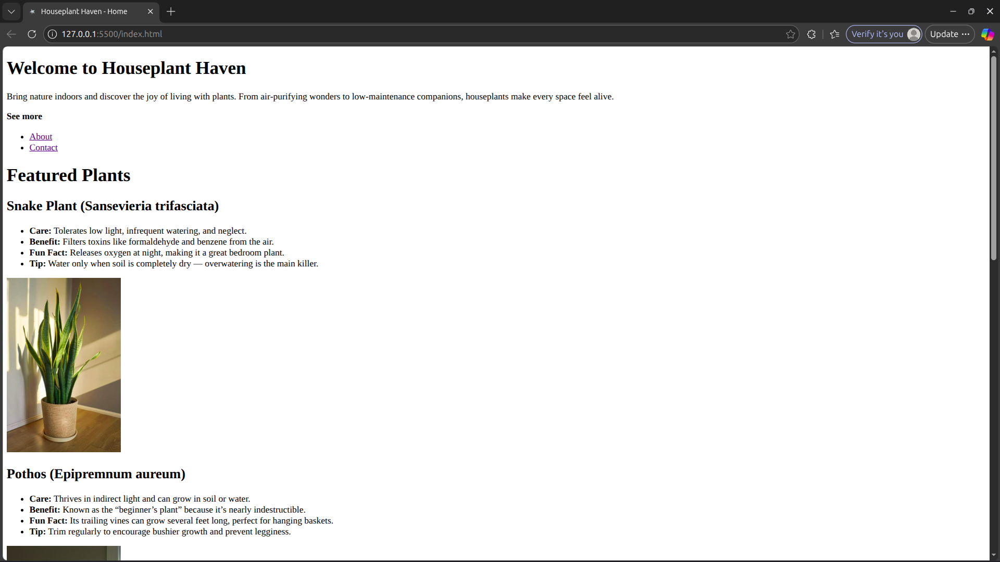
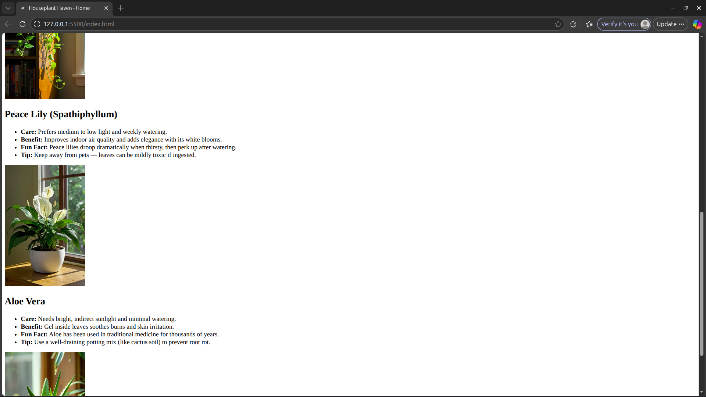
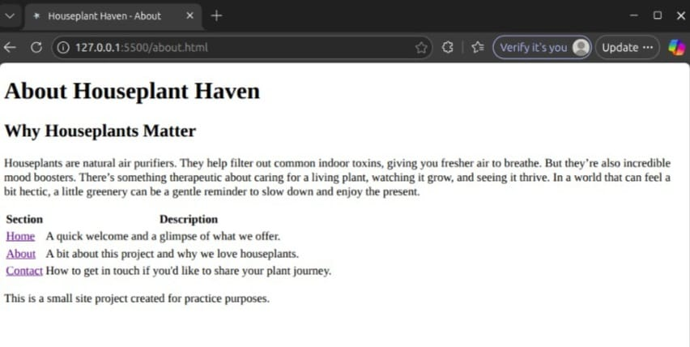
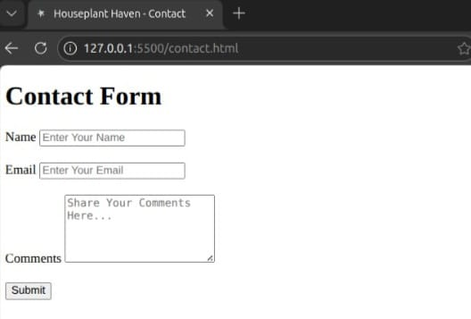
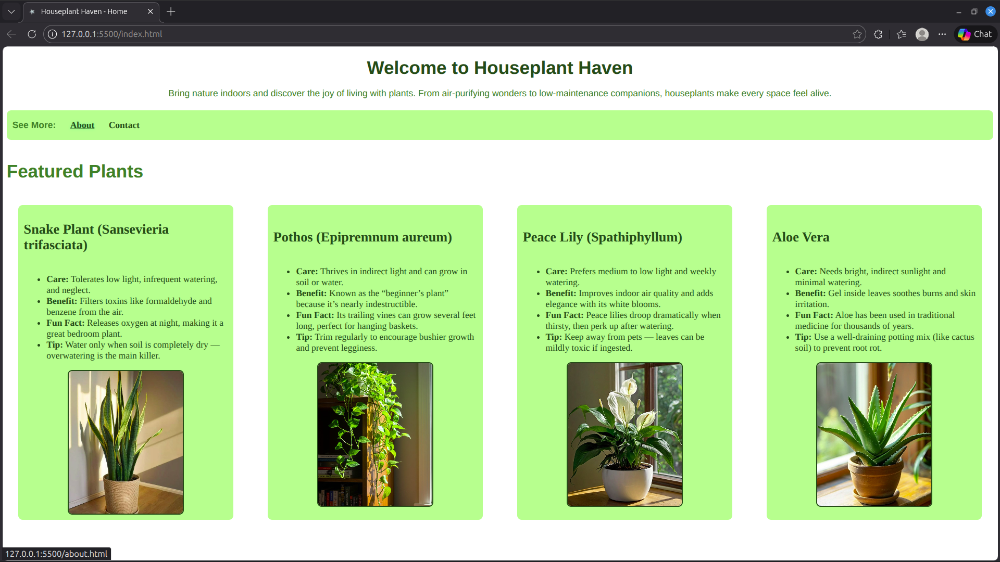
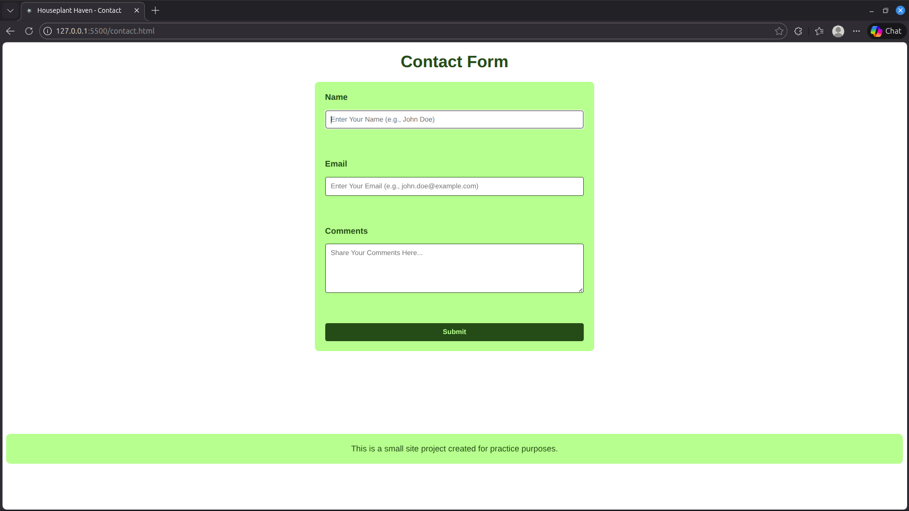

This is a simple site made using only semantic html and basic css (no js yet). I made this to practice and understand html,css,js
#
initial output: 
 
 

#
updated output: 
 
 
 

#
second updated output: 
 
 
 
#
