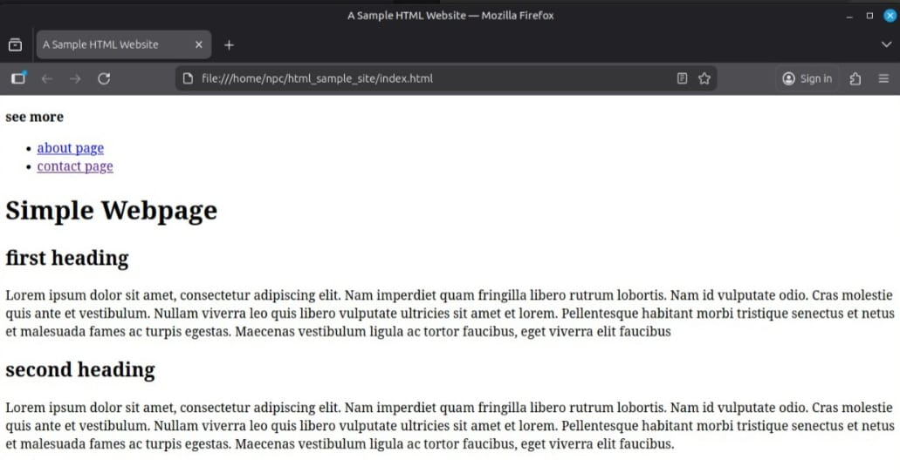
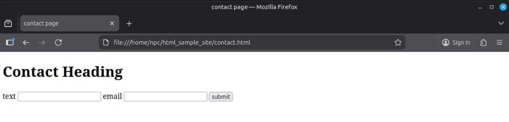
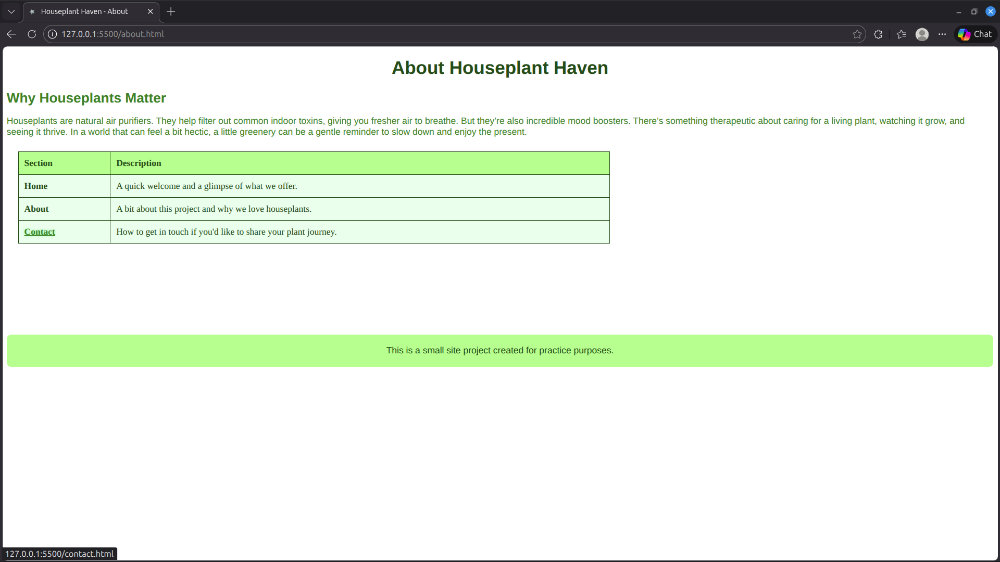
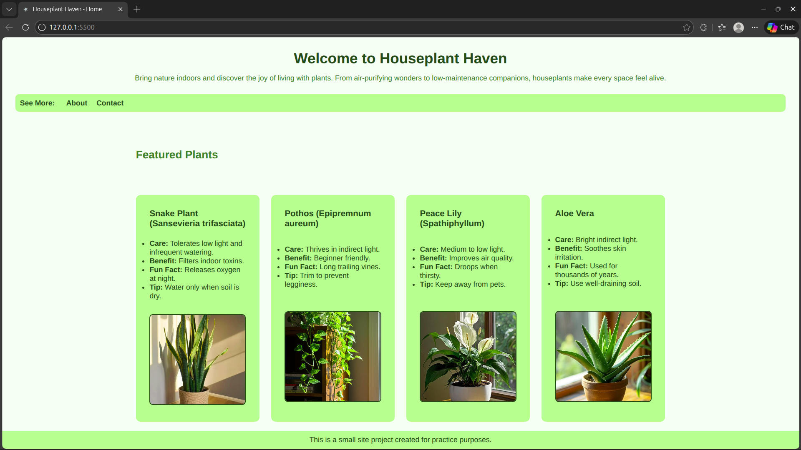
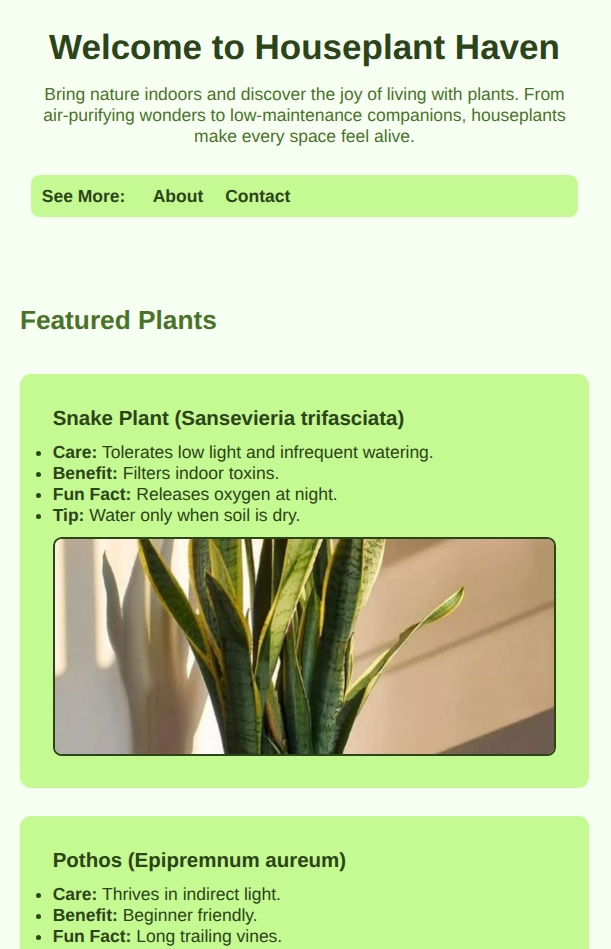
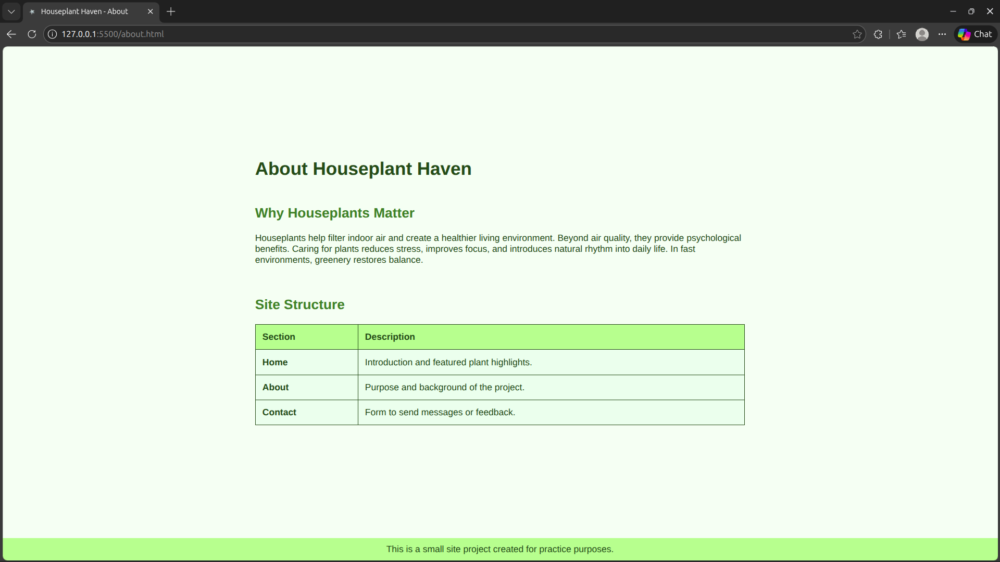
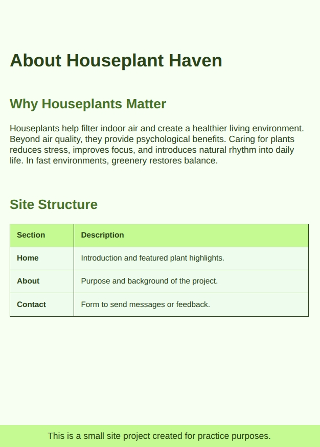
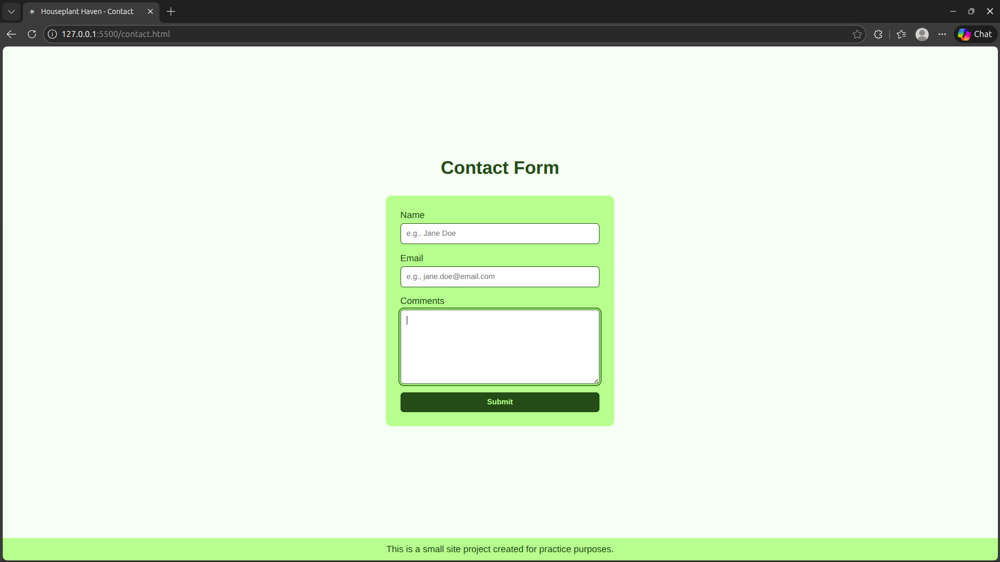
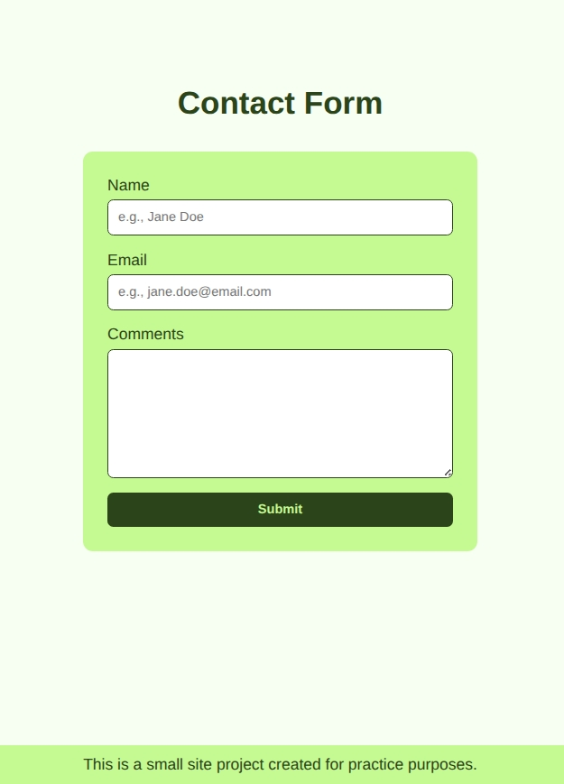

This is a simple site made using only semantic html and basic css (no js yet). I made this to practice and understand html,css,js
#
Initial Output: 
 
 

#
Updated Output: 
 
 
 

#
Second Updated Output: 
 
 
 
#
Third Update Output (with resized ver): 

 

 

 
#
